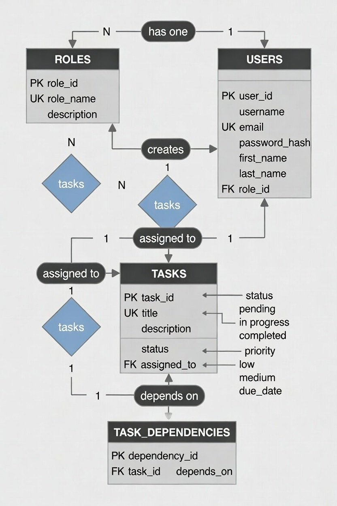
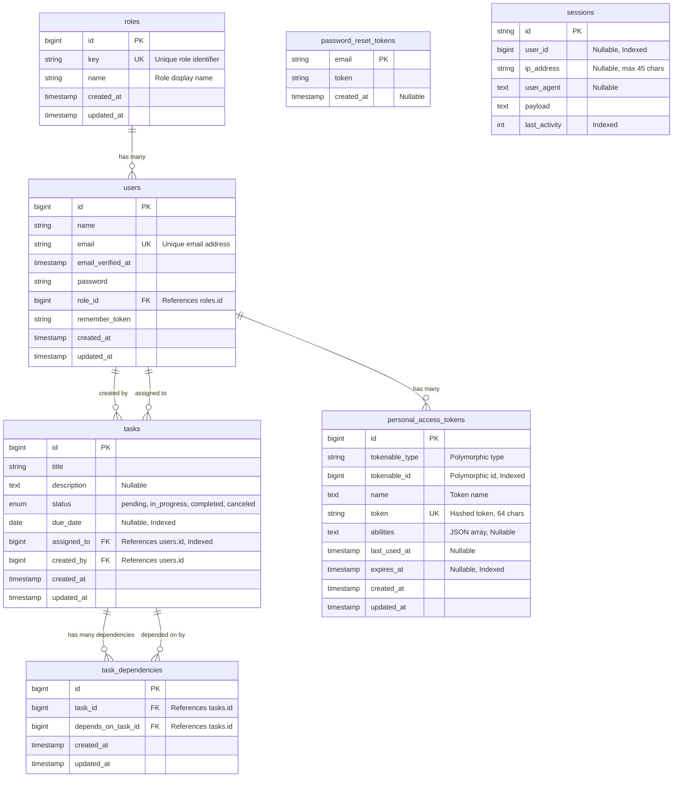

# Task Management System - Entity Relationship Diagram

This document provides a visual representation of the database schema for the Task Management System.

## Database Schema

## Table Descriptions

### Core Tables

#### **roles**

Stores user role definitions (e.g., Manager, User).

- Uses `key` column for role identification in code
- `name` column for display purposes

#### **users**

Stores user account information.

- Each user has exactly one role (belongs to `roles`)
- Users can create and be assigned tasks

#### **tasks**

Stores task information.

- Each task is created by one user (`created_by`)
- Each task is assigned to one user (`assigned_to`)
- Supports task dependencies through `task_dependencies`
- Status: `pending`, `in_progress`, `completed`, `canceled`

#### **task_dependencies**

Defines task dependencies (which tasks depend on which other tasks).

- Prevents duplicate dependencies via unique constraint
- Self-referencing relationship with `tasks` table
- Both `task_id` and `depends_on_task_id` reference the `tasks` table

### Authentication Tables

#### **personal_access_tokens**

Stores API authentication tokens (Laravel Sanctum).

- Polymorphic relationship (typically with `users`)
- Supports token abilities/permissions
- Includes expiration and last-used tracking

#### **password_reset_tokens**

Stores password reset tokens for password recovery.

- One token per email address

#### **sessions**

Stores user session data.

- Optional association with users
- Tracks IP address and user agent

## Relationships Summary

- **One-to-Many**:
    - `roles` → `users` (one role has many users)
    - `users` → `tasks` (one user creates/is assigned many tasks)
    - `users` → `personal_access_tokens` (one user has many tokens)
    - `tasks` → `task_dependencies` (one task has many dependencies)

- **Self-Referencing**:
    - `tasks` → `task_dependencies` → `tasks` (tasks depend on other tasks)

- **Polymorphic**:
    - `personal_access_tokens` → `tokenable` (can belong to any model, typically `users`)

## Indexes

- `users.email` (unique)
- `users.role_id` (foreign key index)
- `tasks.status` (enum index)
- `tasks.due_date` (date index)
- `tasks.assigned_to` (foreign key index)
- `task_dependencies.[task_id, depends_on_task_id]` (unique composite)
- `personal_access_tokens.token` (unique)
- `personal_access_tokens.expires_at` (date index)
- `sessions.user_id` (index)
- `sessions.last_activity` (index)

