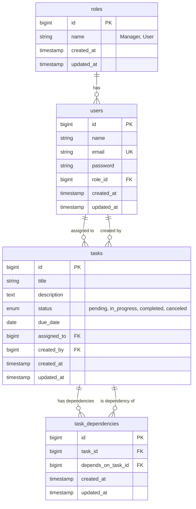

# Entity Relationship Diagram (ERD)

The following diagram illustrates the database schema and relationships for the Task Management System.

## Relationships

1. **Roles & Users**: One-to-Many
    - A Role has many Users.
    - A User belongs to one Role.

2. **Users & Tasks**: One-to-Many
    - A User (Manager) can create many Tasks (`created_by`).
    - A User can be assigned to many Tasks (`assigned_to`).

3. **Tasks & Task Dependencies**: Many-to-Many (Self-Referential)
    - A Task can depend on multiple other tasks (`dependencies`).
    - A Task can be a dependency for multiple other tasks (`dependentTasks`).
    - This logic is handled via the `task_dependencies` pivot table.
